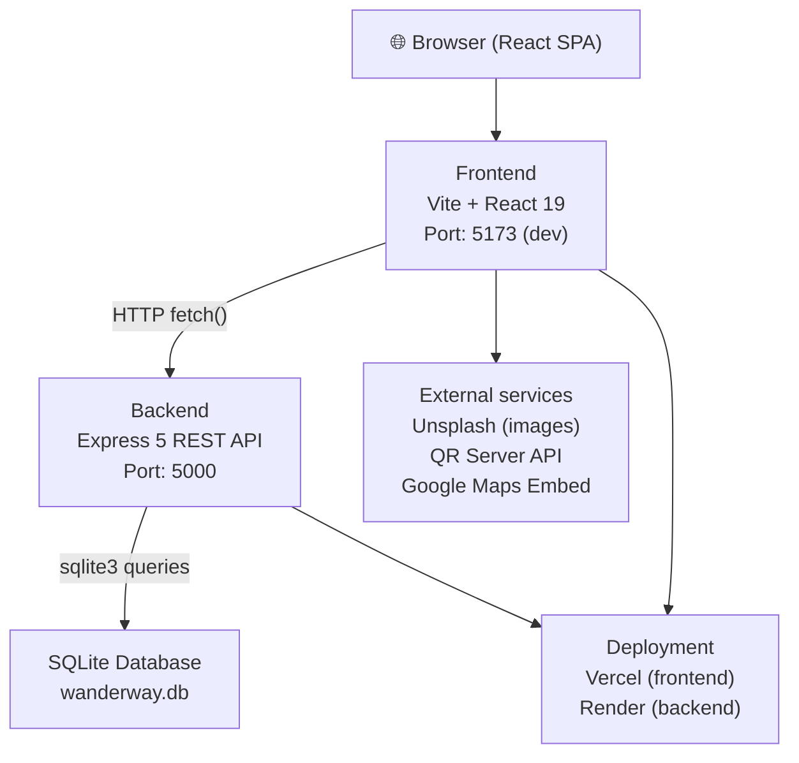
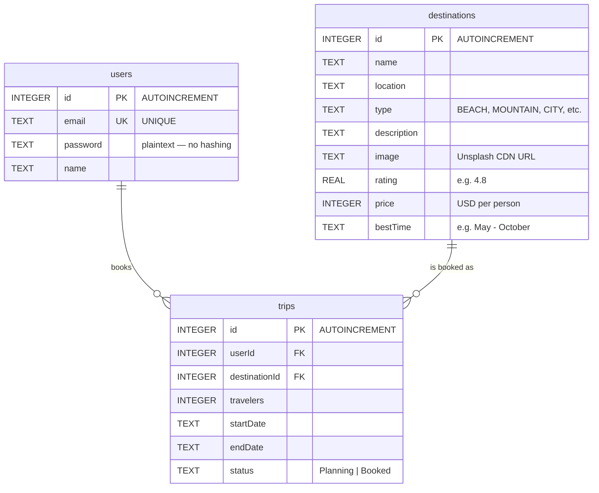

# WanderWay Travels — Project Analysis Report

> Generated: 2026-03-23 | Source: `c:\Users\shank\Desktop\WANDERWAY TRAVELS`

---

## 1. Project Overview

**WanderWay Travels** is a full-stack travel booking web application that allows users to browse curated destinations, view details, authenticate, and complete a simulated booking/payment flow. The project is structured as a monorepo with a Node.js/Express REST API backend and a Vite-powered React SPA frontend.

---

## 2. High-Level Architecture



**Pattern:** Classic Client–Server SPA with a RESTful JSON API. No GraphQL, no WebSockets. No ORM — raw `sqlite3` callbacks.

---

## 3. Technology Stack

### 3.1 Root / Monorepo

| Tool | Version | Purpose |
|------|---------|---------|
| Node.js | (runtime) | JavaScript runtime |
| npm | (runtime) | Package manager |
| `concurrently` | `^9.2.1` | Run frontend & backend dev servers in parallel |

### 3.2 Backend

| Package | Version | Purpose |
|---------|---------|---------|
| `express` | `^5.2.1` | HTTP REST API framework (Express v5!) |
| `cors` | `^2.8.6` | Cross-Origin Resource Sharing middleware |
| `sqlite3` | `5.1.6` | Embedded SQL database driver |

> [!IMPORTANT]
> The backend uses **Express v5** (currently a release candidate / recent stable). This is newer than the widely-documented Express v4 and has some breaking changes (e.g., async error handling). Worth noting if upgrading dependencies.

### 3.3 Frontend

| Package | Version | Role |
|---------|---------|------|
| `react` | `^19.2.4` | UI library (React 19!) |
| `react-dom` | `^19.2.4` | React DOM renderer |
| `react-router-dom` | `^7.13.1` | Client-side SPA routing |
| `lucide-react` | `^0.577.0` | SVG icon library |
| `vite` | `^8.0.1` | Build tool & dev server |
| `@vitejs/plugin-react` | `^6.0.1` | Vite React/JSX transform plugin |
| `eslint` | `^9.39.4` | JavaScript linter |
| `eslint-plugin-react-hooks` | `^7.0.1` | React hooks linting rules |
| `eslint-plugin-react-refresh` | `^0.5.2` | HMR-safe component linting |
| `@types/react` | `^19.2.14` | React TypeScript types (for IDE) |
| `@types/react-dom` | `^19.2.3` | React DOM TypeScript types |

> [!NOTE]
> The project uses **React 19** and **Vite 8** — both very recent major versions.

### 3.4 External Services (no npm install required)

| Service | Usage |
|---------|-------|
| **Unsplash** | Destination card and hero images via CDN URLs |
| **QR Server API** (`api.qrserver.com`) | Dynamic UPI QR code generation for payments |
| **Google Maps Embed** | Interactive destination map via `<iframe>` |
| **Picsum Photos** | Fallback placeholder images on `onerror` |
| **Render.com** | Backend deployment host (`wanderway-travels-3.onrender.com`) |
| **Vercel** | Frontend deployment host |

---

## 4. Data Model

The database (`wanderway.db`) is a **SQLite** file containing three tables.

### Entity-Relationship Diagram



> [!CAUTION]
> **Passwords are stored as plaintext** in the `users` table. There is no hashing (e.g., bcrypt). This is a critical security vulnerability that must be fixed before any production exposure.

### Seed Data
21 destinations are seeded automatically on first run, spanning types: **Beach, Mountain, City, Countryside, Island, Historical, Desert**. Examples: Maldives, Swiss Alps, Machu Picchu, Waikiki Beach, Santorini.

---

## 5. Backend API Surface

Base URL (production): `https://wanderway-travels-3.onrender.com`
Base URL (local dev): `http://localhost:5000`

| Method | Endpoint | Auth | Description |
|--------|----------|------|-------------|
| `POST` | `/api/auth/register` | None | Create new user |
| `POST` | `/api/auth/login` | None | Authenticate user |
| `GET` | `/api/destinations` | None | List all destinations; supports `?search=` and `?type=` query params |
| `GET` | `/api/destinations/:id` | None | Get single destination by ID |
| `GET` | `/api/trips/:userId` | None (by convention) | List trips for a user (JOIN with destinations) |
| `POST` | `/api/trips` | None (by convention) | Create a new trip / booking |
| `DELETE` | `/api/trips/:id` | None | Delete a trip |

> [!WARNING]
> **No authentication middleware** protects any route. Any client can access or delete any trip by guessing an ID. JWT or session-based auth should be added.

---

## 6. Frontend Architecture

### 6.1 File Structure

```
frontend/src/
├── main.jsx              # App entry point (ReactDOM.createRoot)
├── App.jsx               # Root component: Router + AuthProvider + layout
├── index.css             # Global CSS design system (tokens, utilities)
├── App.css               # App-level styles
├── context/
│   └── AuthContext.jsx   # React Context for auth state
├── components/
│   ├── Navbar.jsx        # Top navigation bar
│   └── Footer.jsx        # Global footer
└── pages/
    ├── Home.jsx           # Landing / hero page
    ├── Destinations.jsx   # Browse & filter destinations grid
    ├── DestinationDetail.jsx # Single destination view + booking trigger
    ├── Checkout.jsx       # Multi-step booking + payment form
    ├── MyTrips.jsx        # User's booked trips
    ├── Login.jsx          # Login & registration form
    └── Policies.jsx       # Payment / Cancellation / Refund policy page
```

### 6.2 Component Hierarchy

```
<App>
 ├── <AuthProvider>        (Context: user, login, logout)
 │   └── <Router>
 │       ├── <Navbar />    (uses AuthContext)
 │       ├── <main>
 │       │   ├── / → <Home />
 │       │   ├── /destinations → <Destinations />
 │       │   ├── /destinations/:id → <DestinationDetail />
 │       │   ├── /checkout/:id → <Checkout />  (auth-gated)
 │       │   ├── /trips → <MyTrips />
 │       │   ├── /login → <Login />
 │       │   └── /policies → <Policies />
 │       └── <Footer />
```

### 6.3 State Management

| Scope | Mechanism | Details |
|-------|-----------|---------|
| **Auth State** | React Context API (`AuthContext`) | `user` object, `login()`, `logout()` |
| **Session Persistence** | `localStorage` | Key: `wanderway_user` — survives page refresh |
| **Page-level State** | `useState` hooks | Local to each page component |
| **Data Fetching** | `useEffect` + native `fetch()` | No data-fetching library (no React Query / SWR) |

### 6.4 Routing

Client-side routing via **React Router DOM v7**. Routes are defined declaratively in `App.jsx`. Auth guard is implemented inline in `Checkout.jsx` and `MyTrips.jsx` — if `user` is null, `navigate('/login')` is called inside `useEffect`.

### 6.5 Styling

- **Vanilla CSS** global design system (`index.css`)
- Dark theme with glassmorphism (`.glass-card` components with `backdrop-filter: blur`)
- Purple accent gradient (`#b166e8` → `#d946ef`) called `.text-gradient`
- Utility classes: `.flex`, `.items-center`, `.gap-*`, `.container`, `.btn`, `.btn-primary`, `.btn-secondary`, `.input-control`, `.text-muted`, `.py-5`
- No CSS framework (no Tailwind, no Bootstrap)

---

## 7. Key Feature Breakdown

| Feature | Implementation |
|---------|---------------|
| **User Auth** | Register/Login via `/api/auth/*`; state held in Context + localStorage |
| **Destination Browsing** | Live search (500ms debounce) + category filter + client-side sort (price, rating) |
| **Destination Detail** | Hero banner, stats, embedded Google Map, static testimonials, review input (UI only) |
| **Checkout / Payment** | Hotel selection, room type, travelers, date pickers; Credit/Debit card form OR UPI QR code |
| **UPI QR Payment** | Dynamic QR generated via `api.qrserver.com` encoding a `upi://pay` deep link |
| **My Trips** | Fetches user trips from backend; displays with destination image/name; allows deletion |
| **Policy Pages** | Static content: Payment, Cancellation, Refund, Responsibility policies |
| **Image Fallback** | All `` tags use `onError` to fall back to Picsum Photos |

---

## 8. Deployment Configuration

### Frontend — Vercel
`vercel.json` at root redirects all routes to `/` to support client-side routing (SPA fallback):
```json
{ "routes": [{ "src": "/(.*)", "dest": "/" }] }
```

### Backend — Render.com
- Entry point: `node server.js`
- Port: `process.env.PORT || 5000`
- The `wanderway.db` SQLite file is stored on the server's filesystem — **ephemeral on Render free tier** (resets on restart).

### Dev Workflow (root `package.json`)
```bash
npm run dev          # runs both backend (port 5000) and frontend (port 5173) concurrently
npm run dev:backend  # node server.js only
npm run dev:frontend # vite only
npm run install:all  # installs all three package.json files
```

---

## 9. Observations & Recommendations

| Priority | Issue | Recommendation |
|----------|-------|----------------|
| 🔴 Critical | Plaintext passwords in DB | Add `bcrypt` for password hashing |
| 🔴 Critical | No backend auth middleware | Implement JWT or session tokens; protect `/api/trips` routes |
| 🟠 High | SQLite on Render (ephemeral) | Migrate to PostgreSQL (e.g., Supabase, Neon) for persistent cloud storage |
| 🟠 High | No `.env` / config management | API base URL is hardcoded in multiple files; use `import.meta.env.VITE_API_URL` |
| 🟡 Medium | Review form is UI-only | Backend has no reviews table or endpoint — hook it up or remove the UI |
| 🟡 Medium | Weather widget is static | Shows hardcoded "☀️ 82°F" — integrate a real weather API |
| 🟡 Medium | Sort logic is client-only | Sorting happens after data is fetched; large datasets will be slow — move to backend |
| 🟢 Low | No loading skeleton UI | Replace plain "Loading..." text with skeleton cards for better UX |
| 🟢 Low | No 404 page | Add a catch-all `<Route path="*">` route |

---

## 10. Summary Statistics

| Metric | Value |
|--------|-------|
| Total pages | 7 |
| Total components | 2 (Navbar, Footer) |
| API endpoints | 7 |
| Database tables | 3 |
| Seeded destinations | 21 |
| Destination types | 8 (Beach, Mountain, City, Countryside, Desert, Island, Historical) |
| Frontend dependencies | 4 runtime, 8 dev |
| Backend dependencies | 3 runtime |
| Lines of code (approx.) | ~1,200 JSX + ~350 JS backend |
